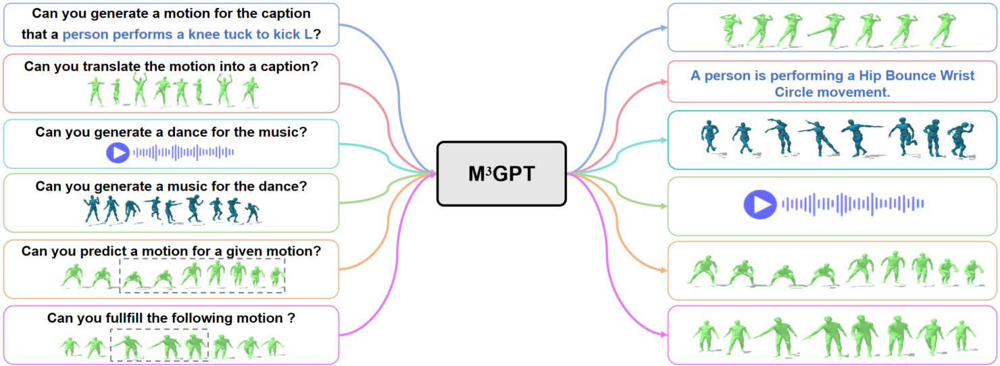

# [M3GPT: An Advanced Multimodal, Multitask Framework for Motion Comprehension and Generation](https://arxiv.org/abs/2405.16273)

Mingshuang Luo1, 2, 3, Ruibing Hou1, Hong Chang1, 3, Zimo Liu2, Yaowei Wang2, Shiguang Shan1, 3

1Key Laboratory of Intelligent Information Processing of Chinese Academy of Sciences (CAS),
Institute of Computing Technology, CAS, China 2Peng Cheng Laboratory, China,
3University of Chinese Academy of Sciences, China

# Abstract
> This paper presents M3GPT, an advanced **M**ultimodal, **M**ultitask  framework for **M**otion comprehension and generation.  M3GPT operates on three fundamental principles. The first focuses on creating a unified representation space for various motion-relevant modalities. We employ discrete vector quantization for multimodal control and generation signals, such as text, music and motion/dance,  enabling  seamless integration into a large language model (LLM) with a single vocabulary.
The second involves modeling model generation directly in the raw motion space. This strategy circumvents the information loss associated with discrete tokenizer, resulting in more detailed and comprehensive model generation. Third, MM3GPT learns to model the connections and synergies among various motion-relevant tasks. Text, the most familiar and well-understood modality for LLMs, is utilized as a bridge to establish connections between different motion tasks, facilitating mutual 
reinforcement. To our knowledge, M3GPT is the first model capable of comprehending and generating motions based on multiple signals.
Extensive experiments highlight M3GPT's superior performance across various motion-relevant tasks and its powerful zero-shot generalization capabilities for extremely challenging tasks.
