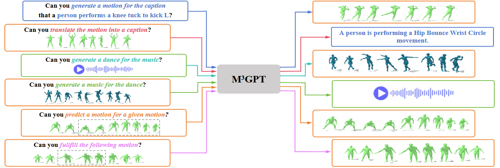

<br/>
<p align="center">
  <h1 align="center">M<sup>3</sup>GPT: An Advanced Multimodal, Multitask Framework for Motion Comprehension and Generation</h1>
  <p align="center">
    <a>Mingshuang Luo</a>,
    <a>Ruibing Hou</a>,
    <a>Zhuo Li</a>,
    <a>Hong Chang</a>,
    <a>Zimo Liu</a>,
    <a>Yaowei Wang</a>,
    <a>Shiguang Shan</a>
  </p>
  <p align="center">
    <a href="https://arxiv.org/abs/2405.16273">
      
    </a>
    <a href='https://luomingshuang.github.io/M3GPT/' style='padding-left: 0.5rem;'>
      
    </a>
  </p>
</p>

---

This is the official repository of **M<sup>3</sup>GPT**, An Advanced Multimodal, Multitask Framework for Motion Comprehension and Generation. 




---


## Environment Preparation

### 1. Conda environment
```bash
# clone project   
git clone https://github.com/luomingshuang/M3GPT.git

# create conda environment
cd M3GPT
conda create -n m3gpt python=3.8
conda activate m3gpt

# install dependencies
pip install torch==2.0.0 --extra-index-url https://download.pytorch.org/whl/cu117
pip install -r requirements.txt
 ```  

## Datasets Preparation
### 1. Download Datasets
This project is implemented with Motion-X, AIST++, and FineDance datasets.

### 2. Preprocess Data
In this project, we focus on the body-part motion (not including face and hand motion). So we use the body feats among the above three datasets to model m3gpt. For all motion data, we unify the frame rate to 30.

## Train the Model

### 1. Train text-motion evaluator

### 2. Train motion vq-vae

### 3. Train music vq-vae

### 4. Multimodal Multitask LLM Pretrain

### 5. Multimodal Multitask LLM Instruction Tune

## Evaluate the Model

### 1. Text-to-Motion

### 2. Motion-to-Text

### 3. Music-to-Dance

### 4. Dance-to-Music

### 5. Motion Prediction/Inbetween

## Visualization